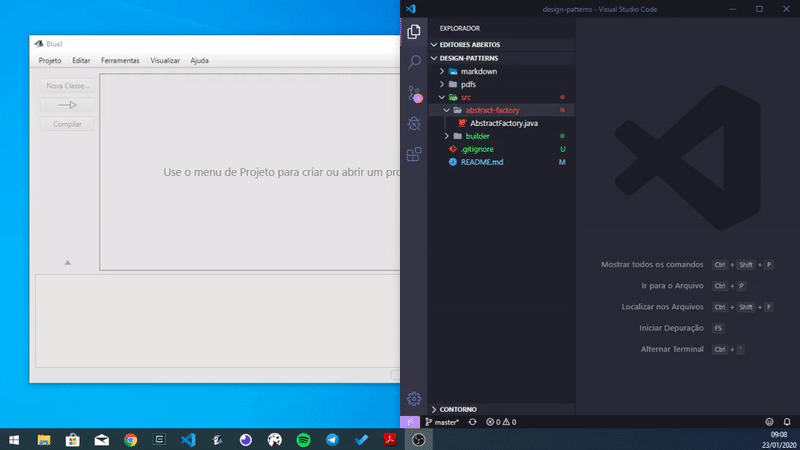

# Design Patterns (Padrões de Projetos)

Este repositório contém os códigos e anotações gerados [neste curso](https://www.udemy.com/course/padroes-de-design-em-java-23-padroes-do-gof-na-pratica/). Fiz uso do editor [BlueJ](https://www.bluej.org/) para desenvolver e compilar os códigos. Para visualizar os códigos basta na pasta **src/nome-do-padrao/**, procure pelo arquivo **NomeDoPadrao.java**, nele estão todas as classes e interfaces antes de serem compiladas. Lendo este arquivo é possível ter uma visão geral do padrão utilizado. A pasta **pdfs/** contém algumas explicações sobre cada padrão.

## Os 23 padrões, na prática, em Java

- [Padrões Criacionais](./markdown/criacionais.md)
- Padrões Estruturais
- Padrões Comportamentais

## Compilando e executando os codigos _.java_

Todos os arquivos **.java** possuem todo o código do exemplo. Para executar abra o editor BlueJ, compile o arquivo e execute a class main. Abaixo, um exemplo disto, em poucos cliques.

