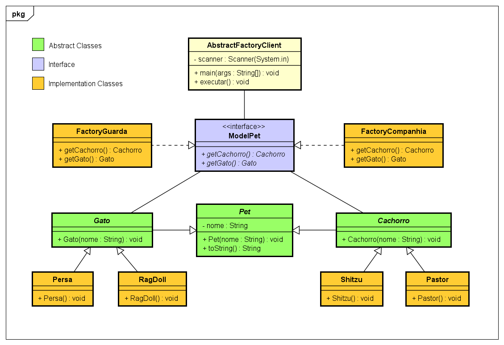
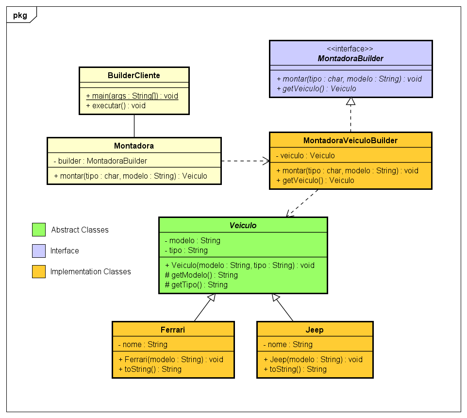

[home](../README.md) < criacionais

## Padrões Criacionais

>"Tratam de uma melhor maneira para instanciar os objetos."

### 5 Padrões

1. [x] Abstract Factory
2. [x] Builder
3. [ ] Factory Method
4. [ ] Prototype
5. [ ] Singleton

| Abstract Factory   | Builder   |
|:--------------------------------------------------------:|:--------------------------------------:|
