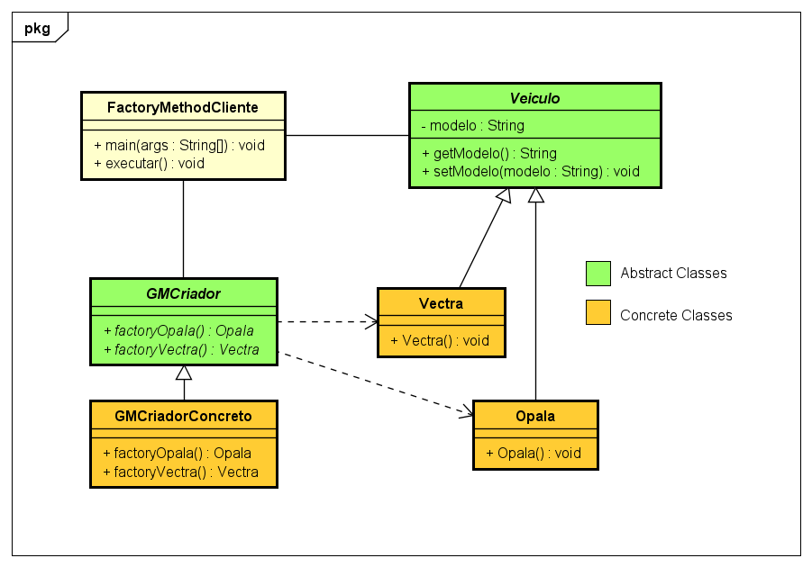

[home](../README.md) < criacionais

## Padrões Criacionais

>_"Tratam de uma melhor maneira para instanciar os objetos."_

### 5 Padrões

1. [x] Abstract Factory
2. [x] Builder
3. [x] Factory Method
4. [ ] Prototype
5. [ ] Singleton

 

*Clique no **Diagrama de Classe UML** para ver a implementação em Java

| Abstract Factory   | Builder   |
|:-----------------------------------------------------------------------------------------------------------------:|:------------------------------------------------------------------------------:|
|     Factory Method       |                                                                                |
|                                                                                                                   |                                                                                |
